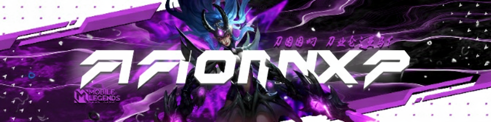
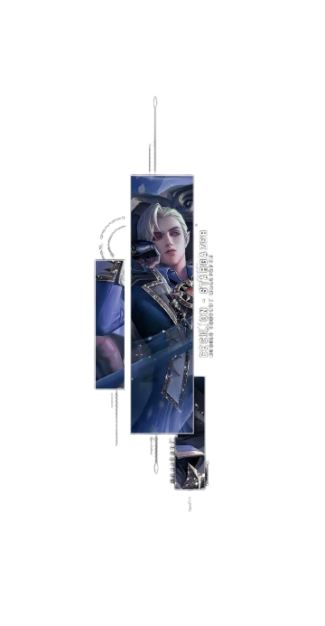
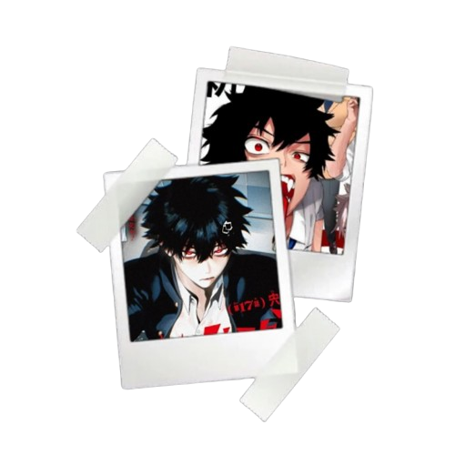

<h1 align="center">𝐻𝑒𝓁𝓁𝑜,I'm Radityo 👋</h1>
𝙸’𝚖 𝚙𝚊𝚜𝚜𝚒𝚘𝚗𝚊𝚝𝚎 𝚊𝚋𝚘𝚞𝚝 𝚊𝚛𝚝𝚒𝚏𝚒𝚌𝚒𝚊𝚕 𝚒𝚗𝚝𝚎𝚕𝚕𝚒𝚐𝚎𝚗𝚌𝚎 𝚊𝚗𝚍 𝚌𝚢𝚋𝚎𝚛𝚜𝚎𝚌𝚞𝚛𝚒𝚝𝚢, 𝚊𝚗𝚍 𝙸’𝚖 𝚕𝚎𝚊𝚛𝚗𝚒𝚗𝚐 𝚖𝚘𝚛𝚎 𝚙𝚛𝚘𝚐𝚛𝚊𝚖𝚖𝚒𝚗𝚐 𝚕𝚊𝚗𝚐𝚞𝚊𝚐𝚎𝚜 𝚝𝚘 𝚐𝚛𝚘𝚠 𝚖𝚢 𝚜𝚔𝚒𝚕𝚕𝚜.
𝙱𝚎𝚢𝚘𝚗𝚍 𝚝𝚎𝚌𝚑, 𝙸 𝚎𝚗𝚓𝚘𝚢 𝚙𝚕𝚊𝚢𝚒𝚗𝚐 𝚘𝚗𝚕𝚒𝚗𝚎 𝚐𝚊𝚖𝚎𝚜 — 𝚖𝚘𝚜𝚝𝚕𝚢 𝙼𝙾𝙱𝙰 𝚊𝚗𝚍 𝚁𝙿𝙶, 𝚠𝚒𝚝𝚑 𝙼𝚘𝚋𝚒𝚕𝚎 𝙻𝚎𝚐𝚎𝚗𝚍𝚜 𝚊𝚜 𝚖𝚢 𝚏𝚊𝚟𝚘𝚛𝚒𝚝𝚎.

 

 

   

   &nbsp;
    
   &nbsp;&#10024; Call me Aaron or more familiarly Radityo

   &nbsp;&#10024; a high school student who has an interest in computers and AI

   &nbsp;&#10024; know basic cyber techniques and the basics of programming

   &nbsp;&#10024; Understanding language, Language (Native), English (Intermediate), Japanese (Basic)

   &nbsp;&#10024; Genre Game:MOBA(5),RPG(5),FPS(3),Turn-Base(1)

   
   ==========================================================================================================================
   
  

 

  
  

   ある日、炎を掴んだ兵士が石壁の静寂を破り現れる。間もなく詩人が立ち上がり、鋼鉄よりも鋭い声で、あらゆる王国を越えて響き渡る。七転び八起き ― 七転び八起き。それが運命の輪だ。そして季節の移り変わりとともに花が咲き誇る時、予言は再び囁く…いつか再び出会う、見えない日まで。
   **For strength may fade and words may scatter, yet the fate of mankind is to rise again, is it not?”**
   
  

